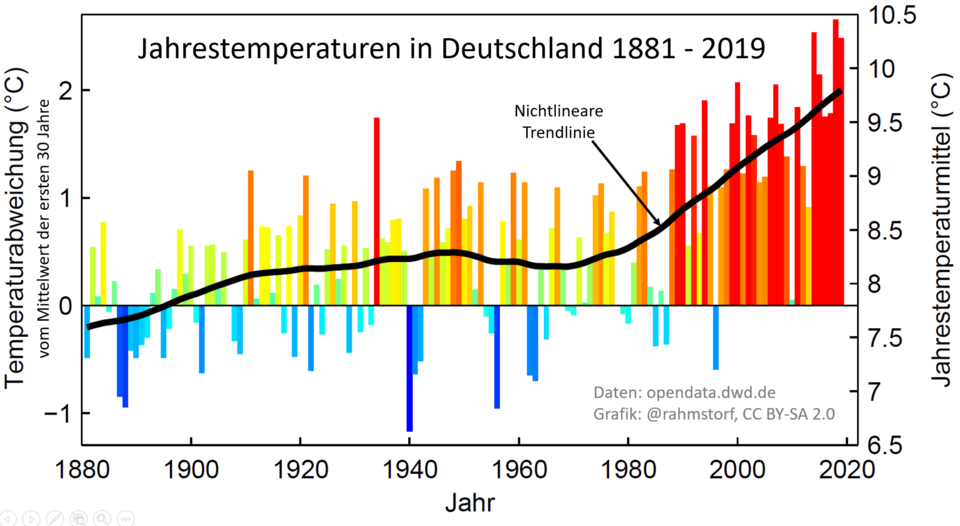

## Begriffsklärung

Was genau bedeuten die Begriffe "Klimawandel", "Klimaschutz" und
"Klimaanpassung"? Wir geben dir dazu jeweils eine kurze Definition. Wenn
du dich tiefer mit diesen Themen beschäftigen möchtest, findest du die
entsprechenden Links im Text.

**Klimawandel**

Die Veränderung der Wetterbedingungen über einen längeren Zeitraum
nennen wir "Klimawandel". Einerseits ist das Erdklima ständigen
Veränderungen unterworfen, andererseits belegen weltweite Messungen,
dass etwa seit Beginn der Industrialisierung (ca. 1850) der Mensch
erheblich zur Erwärmung der Erdatmosphäre beiträgt. Das führt dazu, dass
drastisch beschleunigte Klimaveränderungen erzeugt werden, wie du an der
Grafik unten erkennen kannst. [Quelle](https://www.bpb.de/kurz-knapp/lexika/politiklexikon/296401/klimawandel/)

Abbildung: wikimedia commons; Stefan Rahmstorf; 31 July 2020; Entwicklung der durchschnittlichen Jahrestemperaturen in Deutschland 1881-2019. Abweichung vom Mittelwert der ersten 30 Jahre. Nicht-lineare Trendlinie. CC-BY-SA 2.0

Die Grafik zeigt die Veränderung in der Durchschnittstemperatur in rund
140 Jahren und damit ein wichtiges Merkmal des Klimawandels. Die
auffällige Temperaturerhöhung wird maßgeblich durch menschengemachte
Treibhausgasemissionen verursacht. Damit sind Gase, wie Kohlendioxid und
Methan gemeint, die hauptsächlich durch die Verbrennung von fossilen
Brennstoffen und die Abholzung von Wäldern entstehen. Ihr Anstieg in der
Atmosphäre verstärkt den Treibhauseffekt und führt zur globalen
Erwärmung.

Unter folgendem Link findest du das Thema auch noch in einer
[Multimedia-Darstellung](https://ufz.pageflow.io/co2-budget#304846) sehr gut erklärt.

Die größten Treibhausgasemittenten in Deutschland sind die
Energiewirtschaft, der Verkehrssektor und die Industrie. Im Jahr 2022
war die Energiewirtschaft für 256 Millionen Tonnen CO2-Äquivalente
Treibhausgasemissionen verantwortlich. Der Verkehrssektor ist der
drittgrößte Verursacher von Treibhausgasemissionen in Deutschland, wobei
rund 96 Prozent der Emissionen im Straßenverkehr verursacht werden. Die
Industrie, insbesondere die Chemieindustrie und die Produktion
mineralischer Produkte wie Zement, trägt ebenfalls erheblich zu den
Treibhausgasemissionen bei.

**Klimaschutz**

Wir wissen jetzt also, wodurch die Erderwärmung vorangetrieben wird. Der
nächste Schritt heißt: Wie sehen dann die Maßnahmen aus, um die
Reduktion von Treibhausgasen zu erreichen, also **Klimaschutz?**

Weil sowohl das Klima als auch die Wirtschaft sehr komplex und von einer
Vielzahl von Faktoren beeinflusst werden, ist auch Klimaschutz
vielfältig und komplex. Nehmen wir den Verkehrssektor als Beispiel: Es
werden ordnungsrechtliche (Verkehrsrecht), ökonomische
(Subventionen/CO²-Preis) und infrastrukturelle (Bahn und OPNV)
Instrumente genutzt. 

**Klimaanpassung**

Heute ist leider schon klar: Wir können bestimmte Folgen des
Klimawandels, wie z.B. die Zunahme von Extremwetterereignissen, mit
Klimaschutzmaßnahmen nicht mehr verhindern. Die Hände jetzt in den Schoß
zu legen, ist aber auch nicht die Lösung. Mehr Info für Deutschland [hier](https://www.bundesumweltministerium.de/themen/klimaanpassung/die-deutsche-anpassungsstrategie-an-den-klimawandel)

Zusammengefasst:

- **Klimawandel** ist die Veränderung des Klimas, also der
  durchschnittlichen Wetterbedingungen über einen längeren Zeitraum

- **Klimaschutz** bezeichnet die Rücknahme oder Reduzierung bereits
  existierender wirtschaftlicher und privater Handlungs- und
  Verhaltensweisen, die den Klimawandel verstärkt haben.

- **Klimaanpassung** sind Maßnahmen, die die Widerstandsfähigkeit von
  Gesellschaften und Ökosystemen gegenüber den Auswirkungen des
  Klimawandels stärken sollen.

**Nachhaltigkeit und nachhaltige Entwicklung**

"Nachhaltige Entwicklung ist eine Entwicklung, die den Bedürfnissen der
heutigen Generation entspricht, ohne die Möglichkeiten künftiger
Generationen zu gefährden, ihre eigenen Bedürfnisse zu befriedigen."

Dieses Verständnis von Nachhaltigkeit wurde 1987 im Bericht der
Weltkommission für Umwelt und Entwicklung der Vereinten Nationen
veröffentlicht. [Brundtland-Bericht](https://www.lag21.de/portal-nachhaltigkeit/nachhaltige-entwicklung/)

"Nachhaltigkeit" und "Nachhaltige Entwicklung" haben die gleiche
Bedeutung und beziehen sich auf ökologische Tragfähigkeit, soziale
Gerechtigkeit und wirtschaftliche Stabilität. Dazu einen Beitrag zu
leisten, auch mit diesem Leitfaden, ist für uns Motivation und Vision.

**Biodiversität**

Biodiversität sorgt für die Resilienz von Ökosystemen gegenüber
Störungen wie Klimawandel und Umweltverschmutzung, indem sie eine
Vielfalt an Reaktionen auf solche Stressoren ermöglicht. Biodiversität
ist aktuell durch mehrere Faktoren gefährdet, darunter Habitatverlust,
Klimawandel, Umweltverschmutzung, invasive Arten und Übernutzung
natürlicher Ressourcen. Der Verlust von Lebensräumen, oft durch
Landwirtschaft, Urbanisierung und Infrastrukturentwicklung, zerstört die
natürlichen Umgebungen, die für viele Arten lebenswichtig sind.
