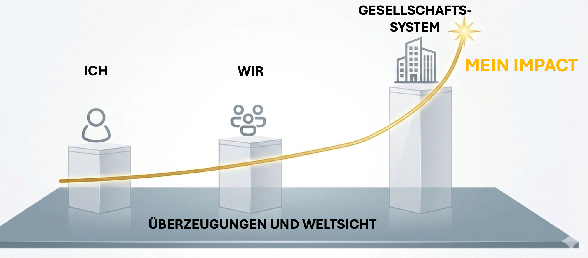

## Unser Handeln

**Das globale Veränderungsprojekt: die Sustainable Development Goals
(SDGs)**

Die für nachhaltige Entwicklung notwendige gesellschaftliche Veränderung
ist nur gemeinschaftlich und global erreichbar. Deshalb haben sich 2015
193 Staaten getroffen, um eine gemeinsame Zielsetzung zu erarbeiten. 17
Ziele für nachhaltige Entwicklung (SDGs) sind entstanden. Alle
beteiligten Staaten haben sich verpflichtet, diese Ziele in nationale
Entwicklungspläne zu überführen und umzusetzen.

Dieser globale Plan zur Förderung nachhaltigen Friedens und Wohlstands
und zum Schutz unseres Planeten legt besonderen Wert darauf, die
Bedürfnisse und Prioritäten der schwächsten Bevölkerungsgruppen und
Länder zu berücksichtigen. Nur wenn niemand zurückgelassen wird, können
die 17 Ziele bis 2030 erreicht werden.

Die Ziele mit ihren Unterzielen und Projekten sind [hier](https://17ziele.de/) detaillierter
dargestellt.

Was im Großen auf staatlicher Ebene angedacht ist, kann dir eine
Orientierungshilfe für dein eigenes Handeln und Wirken sein. Wie kannst
du in deinem persönlichen Umfeld zur Erreichung dieser 17 Ziele
beitragen?

**Klimagerechtigkeit**

Wenn wir über den Umgang mit der Klimakrise nachdenken, ist
Gerechtigkeit ein zentrales Thema. Die ärmere Hälfte der Weltbevölkerung
hat mit 10% nur eine geringe Verantwortung für die CO2-Emissionen. Die
reichsten 10% sind für rund 47 % aller Kohlenstoffdioxid-Emissionen
verantwortlich. Die Gesamtemissionen der reichsten 1% liegen über denen
der ärmeren 50%. [Quelle](https://de.statista.com/infografik/26885/anteil-der-einkommensschichten-an-den-globalen-co2-emissionen/)

Hauptursache der weit größeren CO2-Emissionen der Reichen sind die
größere Wohnfläche, die größeren Autos, aber vor allem das häufige
Fliegen, besonders in Privatjets. Die ärmeren Länder und die ärmere
Bevölkerung in den wohlhabenderen Ländern sind stärker von
Wetterextremen und steigenden Preisen für Nahrungsmittel und Wasser
bedroht als reiche Menschen. Hitzewellen holen sich in den armen
Stadtvierteln mehr Tote als in den reichen Vierteln.

"Lange Trockenzeiten zerstören Ackerflächen. Extreme Wetterereignisse
wie Wirbelstürme und Überschwemmungen führen zu Ernteeinbußen.
Hitzewellen wirken sich auf die Gesundheit von Nutztieren aus.
Landwirt:innen verlieren nicht nur die Möglichkeit, ihre Ernte zu
verkaufen, sondern auch die Nahrungsquelle für ihre Familien." [Quelle](https://www.aktion-deutschland-hilft.de/de/fachthemen/armut/der-klimawandel-und-die-armut/)

**Hebel und Wirksamkeit von Aktivität**

Viele von euch werden mit der Erwartung an diesen Leitfaden treten, dass
es darum geht, was du in deinem Leben ändern kannst, um dich
nachhaltiger zu verhalten. Das ist auch ein Teil der Lösung.

Gleichzeitig müssen wir zur Kenntnis nehmen, dass individuelle
Verhaltensveränderungen nicht ausreichen werden, um innerhalb der
planetaren Grenzen zu bleiben. Ein subjektives Gefühl der
Wirksamkeit im persönlichen Umfeld ist für viele von uns wichtig (siehe
auch Klimagefühle in Woche 2) - das Problem ist nur, dass diese
Wirksamkeit zum Teil eine Illusion ist.

In Deutschland kann ein einzelner Mensch auch mit hoher Anstrengung die
Grenze des CO2-Fußabdrucks nicht unter ca. 5 CO2 Tonnen Emission pro
Jahr drücken. Insofern sind unserer Wirksamkeit durch
Konsumverhalten, Mobilität und Wohnen Grenzen gesetzt, die weit über der
einen Tonne CO2 liegen, die notwendig wäre für Klimaneutralität.

Deshalb müssen wir für eine größere Wirksamkeit auch größere Hebel
anfassen. Das kann kein Mensch alleine leisten. Dieser Lernzirkel wird
dich dabei begleiten, für dich den richtigen Weg zu finden - zu einer
größeren Wirksamkeit mit Freude.

Abbildung: Antje Holst, CC-BY-4.0

Wir starten mit einem Fokus auf die Wirksamkeit als Einzelperson in
Woche 4.

In den Wochen 6 bis 10 machen wir die ersten Schritte zu einer
kollektiven Wirksamkeit. Hier geht es darum, den eigenen Handabdruckzu vergrößern.

Indem wir uns mit anderen Menschen zusammentun und zum Beispiel in der
Firma, der Schule oder der Gemeinde Strukturen anpassen, vergrößern wir
unsere Wirksamkeit. Denn dann ist es zum Beispiel nicht nur die eigene
Familie, die weniger Fleisch isst, sondern viele Menschen ändern ihre
Ernährungsgewohnheiten, wenn zum Beispiel die Qualität des vegetarischen
Essens in der Kantine steigt.

Das Schöne ist, dass durch kollektive Aktivitäten auch die
Ohnmachtsgefühle abnehmen. Häufig bringt es sogar Freude, zusammen mit
anderen lokal wirksam zu werden.

Aber auch lokale Projekte haben einen vergleichsweise kleinen Hebel,
weil unsere gesellschaftlichen Systeme nicht in der Balance sind.

Beispiel Lebensmittel-System:

Während die Lebensmittelproduktion mit ein Drittel aller
Treibhausgasemissionen erheblich zur Klimakrise beiträgt (und außerdem
70 Prozent des weltweiten Süßwassers verbraucht und den Verlust der
Biodiversität vorantreibt), ist die Art der Lebensmittelproduktion weit
davon entfernt das Wohl der Menschheit zu fördern. Über 780 Millionen
Menschen leiden an Hunger, und fast ein Drittel aller produzierten
Lebensmittel wird verschwendet, während gleichzeitig fast drei
Milliarden Menschen sich keine gesunde Ernährung leisten können.

Beispiel Recycling-System:

99% des Plastiks werden aus fossilen Rohstoffen hergestellt. Deswegen
recycelt ein hoher Prozentsatz der deutschen Plastikverpackungen im
Gelben Sack. Aber nur 20% des Plastiks aus dem Gelben Sack wird wieder
zu neuen Produkten recycelt. (Quelle: Podcast NDR Info
"Plastik-Recyling - mehr rausholen aus dem Gelben Sack")

Jetzt kannst du dich fragen, was du dazu machen kannst, um auf
gesellschaftliche Systeme einzuwirken? Auch hierzu wirst du für dich in
diesem Lernzirkel nächste Schritte entdecken. [Denn es reicht, wenn
schon ein relativ kleiner Teil der Bevölkerung aktiv wird: Erica
Chenoweth, Po­li­tik­wis­sen­schaft­le­r:in aus den USA, forscht zu
gewaltfreiem Widerstand und hat Protestbewegungen gegen Regime aus den
letzten 100 Jahren untersucht. Chenoweths Forschungsergebnisse sind
ermutigend und zeigen, dass Bewegungen erfolgreich sind, wenn
nur 3,5 Prozent der Bevölkerung ihre Einstellung/Verhalten ändern.

Alleine ist unsere Wirksamkeit sehr beschränkt - und wird der
Ernsthaftigkeit der Lage und der Stärke unserer Klimagefühle nicht
gerecht. In den nächsten Wochen wirst du für dich konkrete Schritte
entdecken, wie du deine Wirksamkeit erhöhen kannst.

**Handabdruck**

Germanwatch e.V. stellt in diesem Video das [Handabdruck-Konzept](https://www.handprint-hub.de/handabdruck-erklaerfilm-warum-brauchen-wir-die-handabdruck-perspektive) vor, das die positiven und nachhaltigen gesellschaftlichen Gestaltungsmöglichkeiten beschreibt.

Im Unterschied zum Fußabdruck, der sich auf die negativen ökologischen Folgen der menschlichen Lebensweise bezieht, erfasst der [Handabdruck](https://www.germanwatch.org/de/handprint) die Möglichkeiten, Rahmenbedingungen so zu verändern, dass nachhaltiges Verhalten für alle leichter wird.
Handabdruck-Engagement setzt immer an Strukturen, Regeln, Rahmenbedingungen oder Gesetzen an, um
Nachhaltigkeit bleibend und für viele Personen zu verankern.

Deine Handabdruck-Vergrößerung ist damit auch die Fußabdruckverkleinerung anderer Menschen. (G.Baunach, "Hoch die Hände Klimawende", S.41)

**Fußabdruck**

Beim CO2-Fußabdruck und ökologischen Fußabdruck geht es um die
negativen Auswirkungen des Verhaltens.

Der **ökologische Fußabdruck** zeigt, wie viel biologisch produktive
Land- und Wasserflächen ein Individuum, eine Bevölkerung oder eine
Aktivität benötigt, um alle konsumierten Ressourcen zu produzieren und
die anfallenden Abfälle zu absorbieren. Dabei fließt die Nutzung von
Ackerland, Weideland, Waldflächen, Fischgründen und bebauten Flächen
sowie die CO2-Absorption in die Berechnung ein.

Bei der Berechnung des Fußabdrucks ist die gesellschaftliche
Infrastruktur mit eingerechnet.

Der CO2-Fußabdruck ist eine Maßeinheit für den gesamten Betrag
der CO2- Emissionen, welche direkt von Personen oder Produkten verursacht
werden, sowie durch Lebenssituationen und Aktivitäten entstehen. Er ist
nur ein Teil des ökologischen Fußabdrucks.

Wenn du magst, [schau mal, was dein ökologischer Fußabdruck ist](https://uba.co2-rechner.de/de_DE/)!

Viele denken bei der eigenen Wirksamkeit als erstes an die Reduzierung
des eigenen Fußabdrucks. Dabei haben Haushalte mit ca.10% nur einen
sehr geringen Anteil an den CO2 Emissionen [Umweltbundesamt](https://www.umweltbundesamt.de/daten/klima/treibhausgas-emissionen-in-deutschland/kohlendioxid-emissionen#herkunft-und-minderung-von-kohlendioxid-emissionen)

Deswegen ist es deutlich zielführender, den Fokus auf den eigenen
Handabdruck zu legen!

Wenn man als Einzelperson versuchen möchte, klimafreundliche
Entscheidungen zu treffen, dann sind nicht alle gleichermaßen wirksam:

Abbildung: T Brudermann & A Hoeben, Die Kunst der Ausrede (oekom Verlag), Schwierigkeitsgrad und Wirksamkeit klimafreundlicher Entscheidungen. CC-BY-ND

**Inner Development Goals (IDGs)**

Welche Fähigkeiten brauchen wir, um mit der komplexen Welt und ihren
Herausforderungen auf gute Weise umzugehen? Die "inneren
Entwicklungsziele" (IDGs) , beschreiben die dazu nötigen Kompetenzen und
Wege, sie zu entdecken und zu stärken. Die Kompetenzen wurden fünf
Dimensionen zugeordnet: Being, Thinking, Relating, Collaborating, Acting. 

Die Dimensionen beschreiben 23 Fähigkeiten und Qualitäten des
menschlichen inneren Wachstums und der menschlichen Entwicklung.

Das Rahmenwerk wurde von einem Team internationaler Forscher:innen nach
einer umfassenden Outreach-Konsultation mit mehr als tausend Personen
entwickelt.

Weitere Informationen dazu findest du [hier](https://www.innerdevelopmentgoals.org/)

