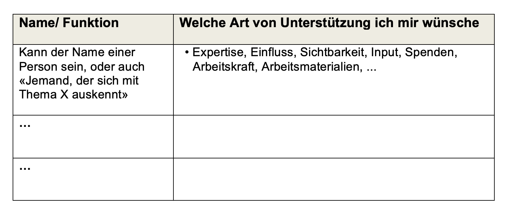

## Kata 7: Mein Netzwerk - Wie gewinne ich Unterstützung?

**Die Agenda:**

- **Check-in:** Welche neuen Verbindungen haben sich aufgetan? (5 Min)

- **Grundlagen:** Die Kraft des eigenen Netzwerks verstehen und 
  zugänglich machen (5 Min)

- **Kata:** Erstelle eine Verbindungsliste (30 Min)

- **Austausch:** Nutze deinen Zirkel (15 Min)

- **Check-out:** Was plane ich für die nächste Woche (5 Min)

**Check-In: Ankommen**

Welche neuen Verbindungen haben sich dir in den letzten Wochen aufgetan?

**Grundlagen: Die Kraft des eigenen Netzwerks verstehen und zugänglich
machen** 

Probleme alleine zu lösen, das ist oft eine Herausforderung. Doch im
gemeinsamen Netzwerk finden wir die Kraft, unsere Wirkung für den
Klimaschutz zu maximieren.

In deinem Umfeld gibt es sicherlich bereits viele Menschen, die bereit
sind, dir zur Seite zu stehen. Und bedenke, dass diese Menschen in
deinem Netzwerk wiederum Kontakte zu anderen haben, die deinem Vorhaben
förderlich sein könnten. Wenn ihr alle dasselbe Ziel verfolgt, dann wird
es nicht mehr \"dein\" Vorhaben sein, sondern \"unser\" Vorhaben.

Du kannst sogar Menschen in dein Netzwerk aufnehmen, die du noch gar
nicht kennst. Es existieren zahlreiche Initiativen, denen du dich
anschließen oder die über die Expertise verfügen, die du für dein
Handabdruck-Projekt benötigst. Der entscheidende Anfang besteht darin,
dein Netzwerk sichtbar zu machen.

**Kata: Erstelle eine Übersicht deines Verbindungs-Netzwerk**

Bei der Übersicht (siehe Grafik unten) erstellst du eine Übersicht
von Menschen, mit denen du bereits verbunden bist oder dich noch
verbinden möchtest. Die Verbundenheit zu diesen Menschen wird dir
ermöglichen, dass sie dich in deiner Challenge unterstützen können.
Diese Kata kannst du immer wiederholen, wenn du einen neue Challenge
oder ein neues Projekt in Angriff nimmst.

Hier sind ein paar Leitfragen, die dir helfen zu verstehen wer alles in
deine Verbindungsliste gehören könnte:

- Wo brauchst du Unterstützung?

- Wo habe ich bereits Verbindungen zu Menschen, die sich auch dafür
  interessieren könnten? (Familie & Freund:innen, Nachbarschaft,
  Vereinsmitglieder, Kolleg:innen, ...)

- Welche Personen haben die Expertise/ das Netzwerk, das ich brauche?\
  Auch wenn ich sie noch nicht kenne? (Initiativen, NGOs, Communities,
  Berufsverbände, Gesellschaft; lokal, landesweit, bundesweit, global)

Für ein bisschen mehr Details und "Ordnung" kannst du deine Übersicht
auch der nachfolgenden Verbindungsliste erweitern und ergänzen durch

- Internet-Recherche

- Gespräche in deinem Umfeld führen

- einen Post auf Social Media schreiben

- ...

**Erstelle eine Verbindungsliste mit 10 Namen:**

Abbildung: Antje Holst, CC-BY-4.0

Notiere die wichtigsten Unterstützer im Climate Action Canvas im
Abschnitt rechts unten **Dein Support-System**.
[Climate Action Canvas auf Miro](https://miro.com/app/board/uXjVNh9bSsQ=/?moveToWidget=3458764592747561193&cot=14) 
[Climate Action Canvas im Internet](https://climateconnections.de/wp-content/uploads/2023/09/ClimateConnectionCanvas_EN.pdf) 

**Austausch: Nutze deinen Zirkel**

Stellt alle reihum eure Zirkel Verbindungslisten vor. Wenn du den
anderen zuhörst, überlege, welche Personen du kennst, die das gerade
vorstellende Zirkel Mitglied mit seinem Vorhaben unterstützen könnten.
Sprecht dann darüber, wie du den Kontakt herstellen kannst.

**Check-out**

Mit wem auf deiner Beziehungsliste möchtest du als erstes in Verbindung
gehen?

**Zitat der Woche**

"Die erfolgreichsten Networker, die ich kenne, die große Mengen an
Empfehlungen bekommen und wahrhaft glücklich mit sich sind, stellen die
Bedürfnisse der anderen Person konsequent über ihre eigenen.\" Bob Burg
