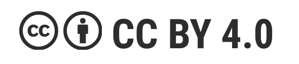

# Willkommen 

\"Die durch den Treibhauseffekt hervorgerufene Erderwärmung gilt als
größte Herausforderung für die Menschheit.\" (Deutsche Welle 03.05.22)

Der Klimawandel erfordert gemeinsames Handeln. Viele Menschen möchten
aktiv werden, wissen aber nicht wie. Unser zwölfwöchiger Leitfaden
bietet euch praktische Übungen und konkrete Schritte für mehr
Nachhaltigkeit im Alltag. Er hilft euch, euer Leben klimafreundlicher zu
gestalten und euren persönlichen Hebel zu finden, euch für eine
nachhaltige Zukunft einzusetzen - ganz nach euren individuellen
Möglichkeiten und ohne erhobenen Zeigefinger.

Stell dir vor, was wäre, wenn wir alle diese Schritte gingen. Stell dir
vor, was wir gemeinsam erreichen können!

Das ist unsere Vision - das wollen wir umsetzen!

**Wie man mit diesem Leitfaden arbeitet:**

- Es gibt ein recht langes Grundlagenkapitel, das man am Anfang lesen
  kann. Nicht alle Hintergrundinformationen sind für die Bearbeitung des
  Lernpfades dringend notwendig.

- Oder man arbeitet sich direkt durch die "Wochen" hindurch. Die Idee
  ist, dass man sich jede Woche mit einer Gruppe Gleichgesinnter trifft,
  um die Inhalte einer Woche zu besprechen. Idealerweise haben sich alle
  auf die Inhalte vorbereitet, zum Beispiel die relevanten Teile des
  Grundlagenkapitels gelesen.

- In den Wochen gibt es "Katas", das sind Aufgaben oder Übungen. lernOS
  benutzt das Wort Kata, in Anlehnung an den Kampfsport.

Ihr könnt mit diesem Leitfaden arbeiten - es gibt auch ein [Miro Board](https://miro.com/app/board/uXjVLxxeDyU=/?share_link_id=436760039156), das hier euch kopieren könnt. Dafür braucht eine:r von euch eine Miro-Lizenz.

lernOS Leitfäden stehen unter der Lizenz [Creative Commons Namensnennung
4.0 International](https://creativecommons.org/licenses/by/4.0/deed.de)
(CC BY 4.0), du darfst sie teilen und bearbeiten, wenn du die Quelle
nennst und keine weiteren Einschränkungen hinzufügst.

